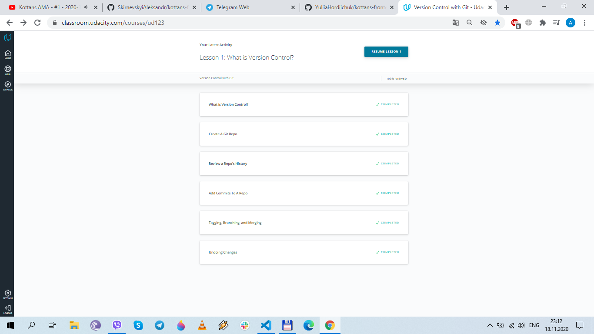
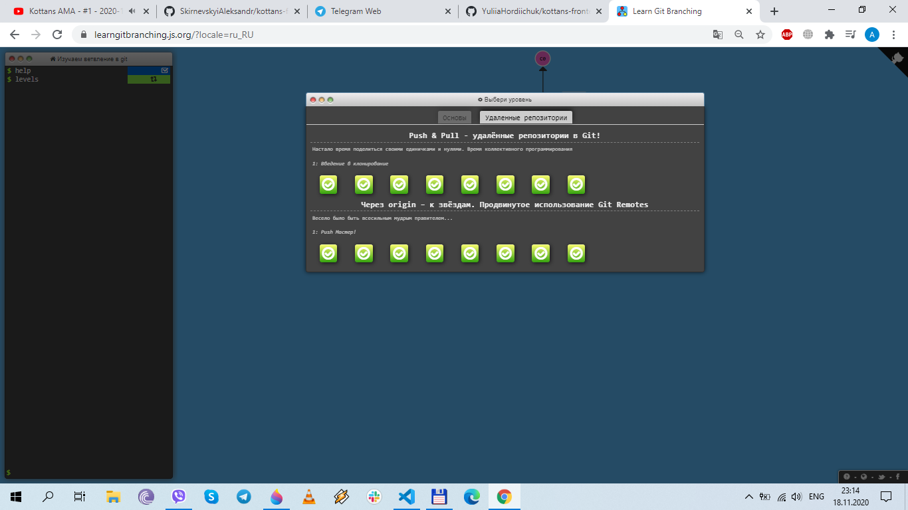

## Git and GitHub

I've already had some experience with Git and Github. Yet I've learned a good few new things. I especially liked [try.github.io](https://try.github.io/levels/1/challenges/1). Sometimes I got stuck and had to google or look at the solution.

