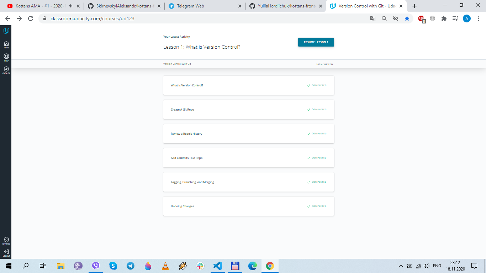
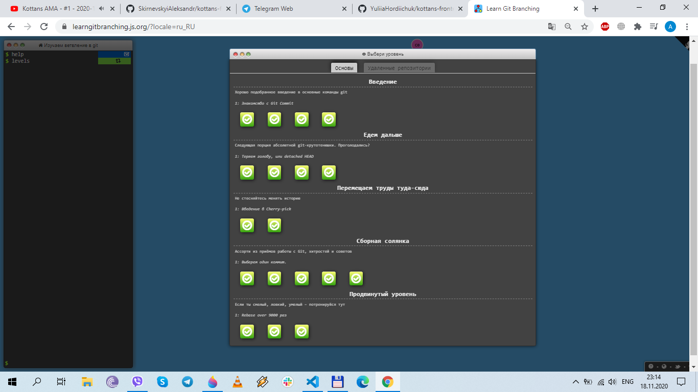

## Git and GitHub

Hello, my name is Alexander. First of all, I want to thank you for the wonderful opportunity to become a part of the Cats Society)). I take my first steps in IT and a lot of things here for the first time. Before this lesson I knew only four commands, now I know much more))).

